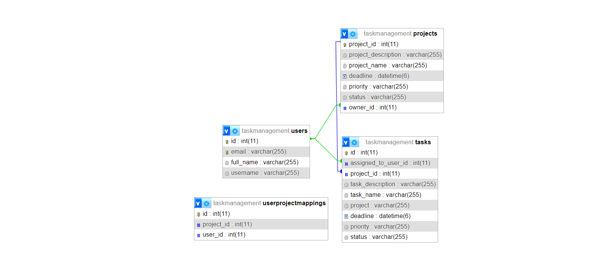

### Spring Boot Overview

Spring Boot is a powerful framework for building Java-based applications with minimal setup and configuration. It simplifies the process of creating robust, production-ready applications by providing a convention-over-configuration approach. 

At its core, Spring Boot leverages the Spring Framework, a comprehensive and modular framework for enterprise Java development. However, Spring Boot takes it a step further by providing out-of-the-box solutions for common tasks such as dependency management, configuration, and application bootstrapping.

With Spring Boot, developers can quickly create standalone, production-grade Spring-based applications with ease. It eliminates the need for boilerplate code and allows developers to focus on writing business logic rather than dealing with infrastructure concerns.

Key features of Spring Boot include:

1. **Auto-configuration**: Spring Boot automatically configures the application based on its dependencies, reducing the need for manual configuration. It intelligently sets up defaults and can be customized as needed.

2. **Standalone**: Spring Boot applications can be deployed as standalone JAR files, which contain everything needed to run the application, including the embedded web server.

3. **Embedded servers**: Spring Boot supports embedded web servers such as Tomcat, Jetty, and Undertow, allowing developers to easily deploy web applications without needing to configure external servers.

4. **Spring Boot Starter**: Starter dependencies provide a quick way to add commonly used dependencies to the project, such as web, data, security, etc. These starters include all the necessary libraries and configurations to get started with a specific functionality.

5. **Actuator**: Spring Boot Actuator provides production-ready features to monitor and manage the application. It exposes endpoints for metrics, health checks, and more, allowing administrators to monitor the application's health and performance.

Overall, Spring Boot simplifies the development process and accelerates time-to-market for Java-based applications by providing a streamlined development experience and a robust ecosystem of libraries and tools.

### "My Trello-Like" Application Functionality

Your "My Trello-Like" application, let's call it "TaskFlow", provides users with a flexible and intuitive platform for managing projects and tasks effectively. Drawing inspiration from Trello's popular Kanban board approach, TaskFlow offers the following features:

- **Project Management**: Users can create and manage multiple projects, each serving as a container for organizing tasks and collaborating with team members.

- **Task Creation and Assignment**: Within each project, users can create tasks, assign them to team members, set due dates, and prioritize them based on urgency or importance.

- **Real-Time Task Updates**: Utilizing the Observer pattern, TaskFlow ensures that users receive instant notifications whenever changes occur within a project, such as task assignments or status updates.

- **Interface**: Similar to Trello, TaskFlow offers a user-friendly interface where tasks can be easily moved and reorganized using intuitive gestures.

- **Role-Based Access Control**: Users are assigned different roles within TaskFlow, such as basic users, project owners, or admins, each with varying levels of permissions and responsibilities.

- **Database Keys and Foreign Keys**: In TaskFlow's database schema, the `task` table has keys referencing other tables:
  - The `assignedToUser` field is a foreign key referencing the `user_id` in the `user` table, indicating the user to whom the task is assigned.
  - The `project_id` field is a foreign key referencing the `project_id` in the `project` table, specifying the project to which the task belongs.

### Observer Pattern in My Application

In my Trello-like application, I've implemented the Observer pattern to ensure efficient communication between projects and their associated users. This pattern facilitates a "publish-subscribe" mechanism where multiple observers (users) are notified of changes to the state of a subject (project). 

When a project undergoes modification, such as the addition of tasks or changes to project details, the Observer pattern ensures that all users assigned to that project receive notifications promptly. This design not only enhances real-time collaboration but also ensures that all stakeholders are kept informed of project updates, fostering transparency and productivity.
  - 

By incorporating these functionalities and technologies, TaskFlow empowers teams to collaborate more efficiently, track project progress in real-time, and ultimately achieve their goals with greater transparency and agility.

